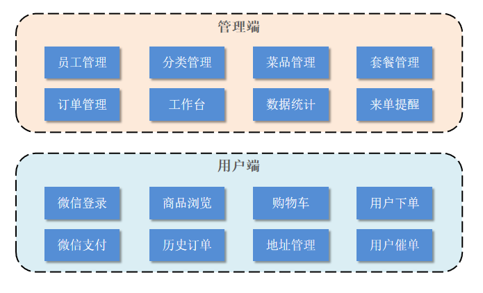
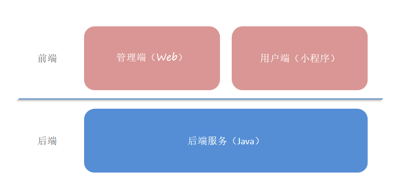

# 苍穹外卖

## 1 苍穹外卖项目介绍

### 1.1 项目介绍

本仓库用于苍穹外卖学习，使用docker部署，主要做以下更改: 

- 引入Mybatis-Plus作为原生Mybatis的增强工具，简化开发，提高效率。基本改为使用Mybatis-Plus的方式，少数复杂情况如多表查询等使用原生Mybatis，部分MP可完成的复用代码抽象到DAO层，提高代码复用性。
- 字段注入从AOP改为使用Mybatis-Plus的自动填充功能，减少代码量，提高代码可读性。
- 更改OpenAPI依赖，更好的提供接口文档。
- Websocket使用WebSocketHandler实现，提供更好的代码可读性。抛弃原有@OnMessage注解方式。
- 其余对代码底层原理更改不大，主要使用个人编码风格进行重构、优化，不再举例。

部署步骤: 

- `git clone https://github.com/wryyyy4444/sky-take-out`
- `cd docs/docker`
- `docker compose --env-file .env.dev up` 启动开发环境
- swagger文档地址：`http://localhost:8080/doc.html`

本项目（苍穹外卖）是专门为餐饮企业（餐厅、饭店）定制的一款软件产品，包括 系统管理后台 和 小程序端应用 两部分。其中系统管理后台主要提供给餐饮企业内部员工使用，可以对餐厅的分类、菜品、套餐、订单、员工等进行管理维护，对餐厅的各类数据进行统计，同时也可进行来单语音播报功能。小程序端主要提供给消费者使用，可以在线浏览菜品、添加购物车、下单、支付、催单等。

接下来，通过功能架构图来展示**管理端**和**用户端**的具体业务功能模块。

**管理端功能**

员工登录/退出 , 员工信息管理 , 分类管理 , 菜品管理 , 套餐管理 , 菜品口味管理 , 订单管理 ，数据统计，来单提醒。

**用户端功能**

 微信登录 , 收件人地址管理 , 用户历史订单查询 , 菜品规格查询 , 购物车功能 , 下单 , 支付、分类及菜品浏览。

### 1.2 产品原型

- **产品原型**
	- **管理端原型图：**  
		
	- **用户端原型图：**  
		

- **管理端**

餐饮企业内部员工使用。 主要功能有:

| 模块      | 描述                                                         |
| --------- | ------------------------------------------------------------ |
| 登录/退出 | 内部员工必须登录后,才可以访问系统管理后台                    |
| 员工管理  | 管理员可以在系统后台对员工信息进行管理，包含查询、新增、编辑、禁用等功能 |
| 分类管理  | 主要对当前餐厅经营的 菜品分类 或 套餐分类 进行管理维护， 包含查询、新增、修改、删除等功能 |
| 菜品管理  | 主要维护各个分类下的菜品信息，包含查询、新增、修改、删除、启售、停售等功能 |
| 套餐管理  | 主要维护当前餐厅中的套餐信息，包含查询、新增、修改、删除、启售、停售等功能 |
| 订单管理  | 主要维护用户在移动端下的订单信息，包含查询、取消、派送、完成，以及订单报表下载等功能 |
| 数据统计  | 主要完成对餐厅的各类数据统计，如营业额、用户数量、订单等     |

- **用户端**

移动端应用主要提供给消费者使用。主要功能有:

| 模块        | 描述                                                         |
| ----------- | ------------------------------------------------------------ |
| 登录/退出   | 用户需要通过微信授权后登录使用小程序进行点餐                 |
| 点餐-菜单   | 在点餐界面需要展示出菜品分类/套餐分类, 并根据当前选择的分类加载其中的菜品信息, 供用户查询选择 |
| 点餐-购物车 | 用户选中的菜品就会加入用户的购物车, 主要包含 查询购物车、加入购物车、删除购物车、清空购物车等功能 |
| 订单支付    | 用户选完菜品/套餐后, 可以对购物车菜品进行结算支付, 这时就需要进行订单的支付 |
| 个人信息    | 在个人中心页面中会展示当前用户的基本信息, 用户可以管理收货地址, 也可以查询历史订单数据 |

### 1.3 技术选型

- **用户层**
    - 前端页面使用 H5、Vue.js、ElementUI、apache echarts；移动端应用使用微信小程序。
- **网关层**
    - Nginx：作为 HTTP 服务器，部署静态资源，支持反向代理和负载均衡。
- **应用层**
    - SpringBoot：快速构建 Spring 项目，简化配置。
    - SpringMVC：Spring 框架的模块，无缝集成。
    - Spring Task：定时任务框架。
    - httpclient：发送 HTTP 请求。
    - Spring Cache：数据缓存框架。
    - JWT：用户身份验证。
    - 阿里云OSS：对象存储服务，存储文件。
    - Swagger：生成接口文档，测试接口。
    - POI：操作 Excel 表格。
    - WebSocket：通信协议，实现来单、催单功能。
- **数据层**
    - MySQL：关系型数据库，存储核心业务数据。
    - Redis：内存数据库，常用作缓存。
    - Mybatis：持久层开发。
    - Mybatis-Plus：基于 Mybatis 的 ORM 框架。
    - spring data redis：简化 Redis 操作。
- **工具**
    - git：版本控制工具，管理代码。
    - maven：项目构建工具。
    - junit：单元测试工具。
    - Hoppscotch：接口测试工具，模拟 HTTP 请求。

